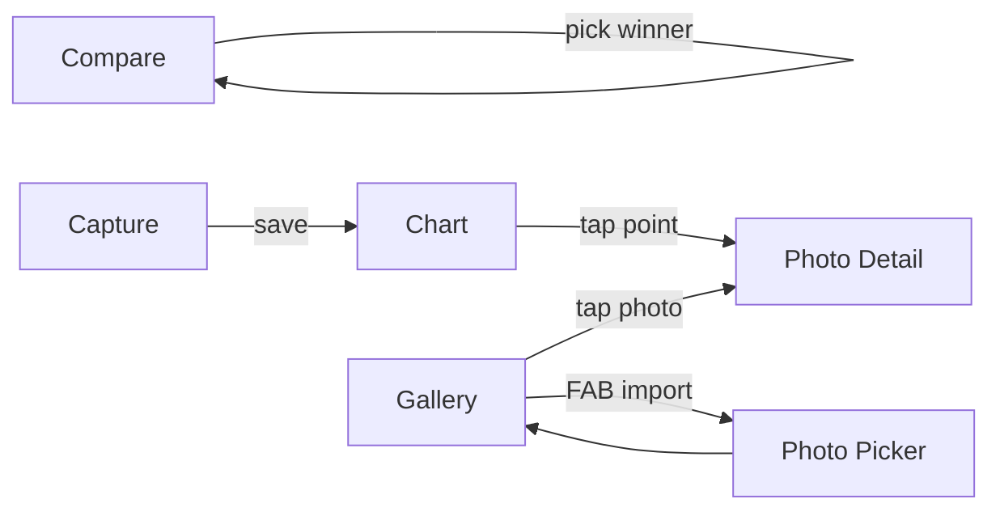

# Skin Tracker — Psoriasis Tracking App Plan

> Created: 2026-05-06 (Europe/Dublin)
> Target: Android (Kotlin + Jetpack Compose, minSdk 26, compileSdk 36)

## 1. Product Summary

A personal psoriasis tracking app. Each day the user adds a photo (face or body) via the in-app camera or by importing from the gallery. Instead of self-rating, the user is shown random pairs of their own photos (within a single category) and picks the one where psoriasis looks better. An Elo rating per photo emerges; the chart visualises the rating over time so the user can see trends.

## 2. Core Features

1. **Capture** — In-app CameraX selfie/back-camera screen with a category toggle (Face / Body).
2. **Import** — Multi-select gallery import via Android Photo Picker. Uses EXIF `DateTimeOriginal` (fallback: file `lastModified`) as the photo's date.
3. **Compare (rating mode)** — Two random photos from the same category are shown side by side; tap the one that looks better. Update Elo for both. Pair selection is random within category, biased toward photos with the fewest comparisons.
4. **Chart** — Interactive zoomable line chart of Elo over time, per category. Time-range buttons (1W / 1M / 3M / 6M / 1Y / All). Landscape-friendly. Tap a data point → bottom sheet showing the photo(s) for that day.
5. **Gallery / Day detail** — Browse all photos by day; delete; re-categorise.

## 3. Tech Stack & Libraries

| Concern | Choice |
|---|---|
| UI | Jetpack Compose + Material 3 |
| Architecture | MVVM with `ViewModel` + `StateFlow`, single-activity, Compose Navigation |
| DB | Room (SQLite) |
| Image storage | App-private internal storage (`filesDir/photos/`), JPEG ~85 quality, max 2048px long edge |
| Image loading | Coil (Compose) |
| Camera | CameraX (`androidx.camera.*`) |
| Gallery import | `ActivityResultContracts.PickMultipleVisualMedia` (Photo Picker) |
| EXIF | `androidx.exifinterface:exifinterface` |
| Charts | **MPAndroidChart** (`com.github.PhilJay:MPAndroidChart`) wrapped in `AndroidView` |
| Concurrency | Kotlin coroutines + Flow |
| DI | Manual (simple `AppContainer`) — keep it simple, no Hilt |
| Permissions | `accompanist-permissions` or raw — raw is fine for camera-only |

Adds to `libs.versions.toml`: room, coil-compose, camerax (core/camera2/lifecycle/view), exifinterface, mpandroidchart, kotlinx-coroutines, navigation-compose. Need `jitpack` repo in `settings.gradle.kts` for MPAndroidChart.

## 4. Data Model (Room)

```
Photo
  id: Long (PK, auto)
  uri: String                     // relative path under filesDir/photos
  category: String                // "FACE" | "BODY"
  capturedAt: Long                // epoch millis (from EXIF or fallback)
  importedAt: Long                // epoch millis when added to app
  rating: Double                  // current Elo, default 1500.0
  comparisonCount: Int            // total comparisons participated in
  wins: Int
  losses: Int
  deleted: Boolean (soft-delete)

Comparison
  id: Long (PK, auto)
  winnerPhotoId: Long (FK)
  loserPhotoId: Long (FK)
  category: String
  comparedAt: Long
  winnerRatingBefore: Double
  loserRatingBefore: Double
  winnerRatingAfter: Double
  loserRatingAfter: Double
```

Indexes on `(category, capturedAt)` and `(category, comparisonCount)`.

## 5. Elo Rules

- Initial rating: **1500.0**
- K-factor: **32**
- Expected: `Ea = 1 / (1 + 10^((Rb - Ra)/400))`
- New rating: `Ra' = Ra + K * (Sa - Ea)` where `Sa ∈ {1, 0}` (no draws in v1)
- Both photos' `comparisonCount` incremented on each comparison.

## 6. Pair Selection (Compare mode)

Within selected category:
1. Sample candidate `A` weighted by `1 / (1 + comparisonCount)` so under-rated photos surface more.
2. Sample `B` the same way, excluding `A`. (No similarity-of-rating bias in v1 per user choice.)
3. If fewer than 2 photos exist in the category, show empty state.

## 7. Chart Behaviour

- One series per photo? No — too noisy. Single series of per-photo points connected in capture-time order, plus an overlay line of **daily mean** rating when a day has ≥2 photos.
- X axis: time (epoch millis), formatted relative to range.
- Y axis: Elo rating (auto-fit, with sensible min/max padding).
- Pinch zoom + drag pan enabled. Double-tap to reset.
- Range chips: 1W, 1M, 3M, 6M, 1Y, All — adjusts visible window.
- Category tabs at top: Face / Body.
- Landscape: chart fills width; range chips collapse into a row.
- Tap a point → bottom sheet showing the photo for that record (or list if daily-mean point overlaps multiple).

## 8. Screens & Navigation

```
NavHost
├── home (chart screen, default)         [route: "home"]
├── capture                              [route: "capture"]
├── compare                              [route: "compare"]
├── gallery                              [route: "gallery"]
└── photoDetail/{photoId}                [route: "photo/{id}"]
```

Bottom navigation bar with 4 destinations: **Chart**, **Compare**, **Capture**, **Gallery**.



## 9. Module / Package Layout

Keep files small (<500 lines). Single Gradle module `:app` with packages:

```
com.example.skin_tracker
├── MainActivity.kt
├── SkinTrackerApp.kt                    // NavHost + Scaffold + bottom bar
├── di/AppContainer.kt
├── data
│   ├── db/AppDatabase.kt
│   ├── db/PhotoDao.kt
│   ├── db/ComparisonDao.kt
│   ├── db/Converters.kt
│   ├── entity/PhotoEntity.kt
│   ├── entity/ComparisonEntity.kt
│   ├── repo/PhotoRepository.kt
│   ├── repo/ComparisonRepository.kt
│   └── storage/PhotoFileStore.kt        // save/copy/load files
├── domain
│   ├── model/Category.kt                // enum FACE, BODY
│   ├── model/Photo.kt                   // domain model
│   ├── rating/Elo.kt                    // pure functions
│   └── rating/PairPicker.kt
├── ui
│   ├── theme/* (existing)
│   ├── chart/ChartScreen.kt
│   ├── chart/ChartViewModel.kt
│   ├── chart/MpLineChartView.kt         // AndroidView wrapper
│   ├── chart/RangeChips.kt
│   ├── compare/CompareScreen.kt
│   ├── compare/CompareViewModel.kt
│   ├── capture/CaptureScreen.kt
│   ├── capture/CaptureViewModel.kt
│   ├── capture/CameraPreview.kt
│   ├── gallery/GalleryScreen.kt
│   ├── gallery/GalleryViewModel.kt
│   ├── detail/PhotoDetailScreen.kt
│   ├── detail/PhotoDetailViewModel.kt
│   └── common/* (shared composables)
└── util
    ├── ExifDateReader.kt
    └── ImageImporter.kt
```

## 10. Permissions

`AndroidManifest.xml` additions:
- `android.permission.CAMERA`
- `android.hardware.camera.any` feature (not required, optional)
- No storage permissions needed: Photo Picker is permissionless on API 26+; private file storage doesn't need permissions.

Camera permission requested at runtime on entry to Capture screen.

## 11. Key UX Details

- Capture screen: front-camera by default for face; flip button; large shutter; category toggle remembered.
- After capture: a confirmation card (thumbnail + category + "Save" / "Retake").
- Gallery import: after picking N photos, brief progress + per-photo result toast.
- Compare screen: two big tappable images filling the screen; "Skip" button; haptic on tap; counter "Comparisons today: N".
- Chart screen: empty state "Add 2 photos to start tracking".
- Photo detail: full-screen image, swipe between photos of that day, info row (date, category, rating, # comparisons), delete with confirm.

## 12. Implementation Phases (todo order)

1. Project setup: dependencies, repos, manifest permissions.
2. Data layer: Room DB, entities, DAOs, repository.
3. File storage: `PhotoFileStore` + `ExifDateReader`.
4. Domain: `Category`, `Elo`, `PairPicker`.
5. App scaffold: navigation + bottom bar + theme tweaks.
6. Capture screen with CameraX.
7. Gallery screen + Photo Picker import.
8. Compare screen.
9. Chart screen with MPAndroidChart.
10. Photo detail screen.
11. Polish: empty states, landscape, error handling, README update.
12. Build & install via `./gradlew installDebug`.

## 13. Out of Scope (v1)

- Cloud backup / sync.
- Multi-user.
- ML body-part detection / auto-categorisation.
- Export of data.
- Reminders / notifications (could be a nice v2).
- Glicko-2 or any rating system other than Elo.
